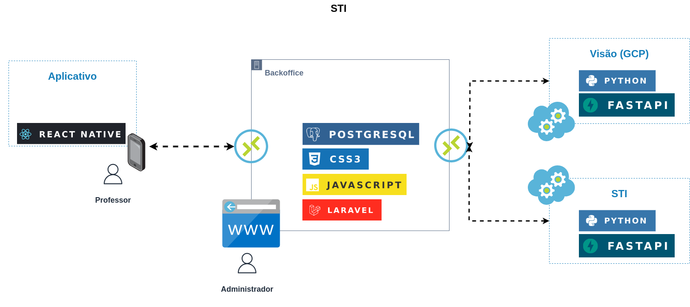

# Teste seletivo para vaga de Tester

Olá! 👋

Se você esta lendo este texto, significa que convidamos você para participar do nosso teste seletivo para Tester. Você desempenhará um papel fundamental no projeto, testando a nossa solução. Antes, então, vamos apresentar um pouco do que temos até aqui!

O projeto é um aplicativo móvel que auxiliará o professor em sala de aula no ensino da disciplina de matemática. A ideia é termos um sistema de inteligência por trás, gerando e recomendando listas de atividades de acordo com a dificuldade do(s) aluno(s) e auxiliar o professor a identificar grupos de alunos com as mesmas dificuldades.

A correção das atividades são realizadas usando um outro sistema especialista, onde o professor tira uma foto e o sistema de visão busca a resposta na imagem, e retorna para o nosso sistema, que então, corrige e aponta, se houver, o erro que o aluno cometeu.

Para resumir em uma imagem, nosso sistema se encontra assim:

Por trás da construção de tudo isso, temos uma equipe multidisciplinar, com pessoas de diversas áreas. E estamos querendo crescer, e você será fundamental neste processo.

Agora vamos lá, o teste é bem simples. Dado o nosso cenário, elabore um roteiro de testes. O que queremos avaliar num primeiro momento é construção do roteiro. Não temos um template, você esta livre para montar da maneira que achar adequado.

Só pedimos que siga as seguintes instruções:

- faça um fork deste repositório;
- usar **markdown** para elaborar o seu roteiro, fique a vontade para incluir imagens, diagramas, ou qualquer outro artefato - não precisa fazer neste `README.md`, pode criar outro(s) arquivo(s);
- enviar um email contendo:
  - título: "Submissão Tester"
  - link para o repositório
  - respondendo as perguntas:
    - O que você achou do teste?
    - Quais foram os pontos positivos e negativos do teste?
    - O que podemos melhorar?

Boa sorte 🍀! Aguardamos sua submissão!
